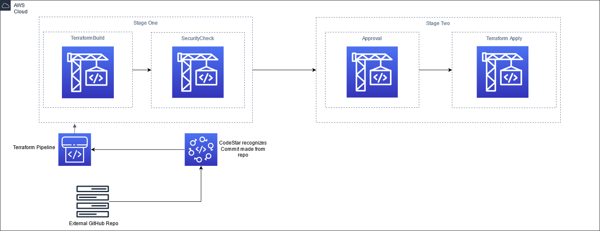

<div id="top"></div>
<!--
*** Thanks for checking out the Best-README-Template. If you have a suggestion
*** that would make this better, please fork the repo and create a pull request
*** or simply open an issue with the tag "enhancement".
*** Don't forget to give the project a star!
*** Thanks again! Now go create something AMAZING! :D
-->


<!-- PROJECT SHIELDS -->
<!--
*** I'm using markdown "reference style" links for readability.
*** Reference links are enclosed in brackets [ ] instead of parentheses ( ).
*** See the bottom of this document for the declaration of the reference variables
*** for contributors-url, forks-url, etc. This is an optional, concise syntax you may use..
*** https://www.markdownguide.org/basic-syntax/#reference-style-links
-->

<!-- [![Issues][issues-shield]][issues-url]
[![LinkedIn][linkedin-shield]][linkedin-url] -->

<!-- PROJECT LOGO -->
 <!--  -->
<div align="center">
<br />
<h3 align="center">CI/CD pipeline for terraform</h3>

  <p align="center">
     A CI/CD pipeline for planing,testing,and deploying terraform.Built using terraform
    <br />
  </p>
</div>



<!-- TABLE OF CONTENTS -->
<details>
  <summary>Table of Contents</summary>
  <ol>
      <a href="#getting-started">Getting Started</a>
      <ul>
        <li><a href="#prerequisites">Prerequisites</a></li>
        <li><a href="#installation">Installation</a></li>
      </ul>
    </li>
    <li><a href="#license">License</a></li>
    <li><a href="#contact">Contact</a></li>
  </ol>
</details>


<!-- GETTING STARTED -->

### Getting started

Create an S3 bucket in the account the code will be run against to store your statefile.
Default region is us-west-2, to change , change the region variable in variables.tf to the correct region

IMPORTANT!

make sure to change the full_repo_name,and git_hub_url in the CodePipeline Modules

Note that after the enviroment is built you need to go to CodePipeline ->  Settings -> Connections -> Update Pending Connection in order to run the pipeline with your GitHub repo.

### Prerequisites

1. You have terraform installed on your local machine
2. You have an AWS account and user with access to perform the provisioning of infrastructrue
3. You have  AWSCLI tools installed
4. you have created a s3 bucket for the terraform state file

### Installation

1. update ./aws/config and ./aws/credentials with the user and access keys needed to acces your aws account
2. create s3 bucket for statefile
3. Clone the repo
   ```sh
   git clone https://gitlab.aws.dev/ausmillr/ci-cd-pipeline-terraform-solution.git
   ```
4. Add s3 bucket , and region to the backend config backend.tf. if you want the state file in another folder add that path in front of terraform.tfstate ie."path/terraform.tfstate"
   ```sh
   backend "s3", bucket = "my-bucket-name" region ="us-west-2"
  
5. initialize terraform
   ```sh
    terraform init
   ```
6. apply terraform
   ```sh
    terraform apply
   ```

<p align="right">(<a href="#top">back to top</a>)</p>

<!-- ROADMAP -->
## Roadmap

- [x] Add Security (KMS/IAM)
- [x] Add S3
- [x] Pipeline infrastructure
    - [x] Apply

See the [open issues](https://gitlab.aws.dev/ausmillr/ci-cd-pipeline-terraform-solution/-/issues) for a full list of proposed features (and known issues).

<p align="right">(<a href="#top">back to top</a>)</p>


<!-- LICENSE -->
## License

 See `LICENSE` for more information.

<p align="right">(<a href="#top">back to top</a>)</p>


<!-- CONTACT -->
## Contact

Austin Miller -  ausmillr@amazon.com

Project Link: [https://gitlab.aws.dev/ausmillr/ci-cd-pipeline-terraform-solution.git](https://gitlab.aws.dev/ausmillr/ci-cd-pipeline-terraform-solution.git)

<p align="right">(<a href="#top">back to top</a>)</p>


<!-- MARKDOWN LINKS & IMAGES -->
<!-- https://www.markdownguide.org/basic-syntax/#reference-style-links -->
[contributors-shield]: https://img.shields.io/github/contributors/GitHub-account-username/CI_CD-solution-with-terrafrom.svg?style=for-the-badge
[contributors-url]: https://gitlab.aws.dev/ausmillr/ci-cd-pipeline-terraform-solution.git/graphs/contributors
[forks-shield]: https://img.shields.io/github/forks/GitHub-account-username/CI_CD-solution-with-terrafrom.svg?style=for-the-badge
[forks-url]: https://gitlab.aws.dev/ausmillr/ci-cd-pipeline-terraform-solution/-/network/members
[stars-shield]: https://img.shields.io/github/stars/GitHub-account-username/CI_CD-solution-with-terrafrom.svg?style=for-the-badge
[stars-url]: https://gitlab.aws.dev/ausmillr/ci-cd-pipeline-terraform-solution.git/-/stargazers
[issues-shield]: https://img.shields.io/github/issues/GitHub-account-username/CI_CD-solution-with-terrafrom.svg?style=for-the-badge
[issues-url]: https://gitlab.aws.dev/ausmillr/ci-cd-pipeline-terraform-solution/-/issues
[license-shield]: https://img.shields.io/github/license/GitHub-account-username/CI_CD-solution-with-terrafrom.svg?style=for-the-badge
[license-url]: https://gitlab.aws.dev/ausmillr/ci-cd-pipeline-terraform-solution.git/blob/main/LICENSE
[linkedin-shield]: https://img.shields.io/badge/-LinkedIn-black.svg?style=for-the-badge&logo=linkedin&colorB=555
[linkedin-url]: https://linkedin.com/in/austin-miller-064b45128
[product-screenshot]: images/screenshot.png
